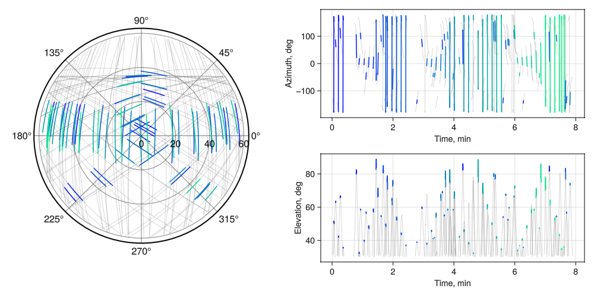

# TelescopeTasking.jl

Solve the short-term telescope tasking problem for single or multiple telescopes via a job-shop scheduling problem (JSSP) approach. 

[2025 AAS/AIAA Space Flight Mechanics paper](https://s3.amazonaws.com/amz.xcdsystem.com/A464D031-C624-C138-7D0E208E29BC4EDD_abstract_File24835/PreprintPaperUploadPDF_321_0103063552.pdf)





### Quick start

This repository is developed on Julia v1.10. Download from: [https://julialang.org/downloads/](https://julialang.org/downloads/). 
Once julia is setup, `git clone` and `cd` to the repository, start the julia-repl, then run

```julia
julia> ]
(@v1.10) pkg> activate .
(TelescopeTasking) pkg>
```

Then, run tests to check installation is successful:

```julia
(TelescopeTasking) pkg> test
```

Jupyter notebook examples are located in [`./examples`](https://github.gatech.edu/SSOG/TelescopeTasking.jl/tree/main/examples). 


### Dependencies

Dependencies are listed in `Project.toml`. 
Part of the package dependencies are subsets of the [SatelliteToolbox.jl](https://juliahub.com/ui/Packages/General/SatelliteToolbox) developed by the [Brazilian National Institute for Space Research (INPE)](https://www.gov.br/inpe/pt-br), namely:

- [SatelliteToolboxTle.jl](https://github.com/JuliaSpace/SatelliteToolboxTle.jl) for handling TLEs
- [SatelliteToolboxSgp4.jl](https://github.com/JuliaSpace/SatelliteToolboxSgp4.jl) for propagation
- [SatelliteToolboxTransformations.jl](https://github.com/JuliaSpace/SatelliteToolboxTransformations.jl) for frame transformations

The `TLE` object's structure can be found in the [SatelliteToolboxTle.jl docs page](https://juliaspace.github.io/SatelliteToolboxTle.jl/stable/man/tle_structure/). 


### Scripts for 2025 AAS/AIAA Space Flight Mechanics Meeting

Scripts for the 2025 AAS SFMM conference are located in folder `./scripts`;

#### Run experiments: 

- `scripts/solve_STTP.jl` : solve an instance of the STTP with $E = 1,2,3$ with chosen target set
- `scripts/solve_MTTP.jl` : solve an instance of the MTTP with $E = 1,2,3$ with chosen target set
- `scripts/greedy_STTP.jl` : run greedy algorithm on STTP instances with $E = 1$
- `scripts/greedy_MTTP.jl` : run greedy algorithm on MTTP instances with $E = 1$
 

#### Visualizations:

- `animate_targets.jl` : ECEF 3D animation of targets, colored by pass & observation status (see animation below)
- `plot_STTP_slew.jl` : slew history, colored by elapsed time (Fig. 5 in conference manuscript)
- `plot_MTTP_solution_passes.jl` : all passes for each observer (Fig. 6, 9)


